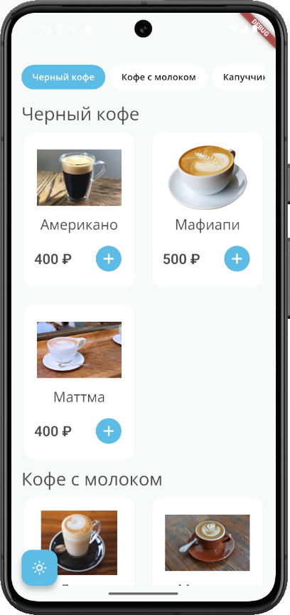
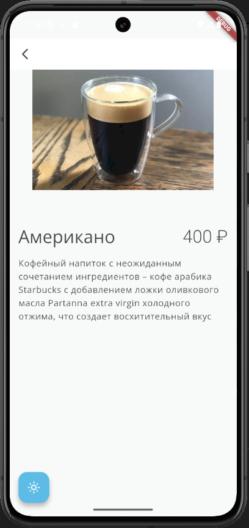
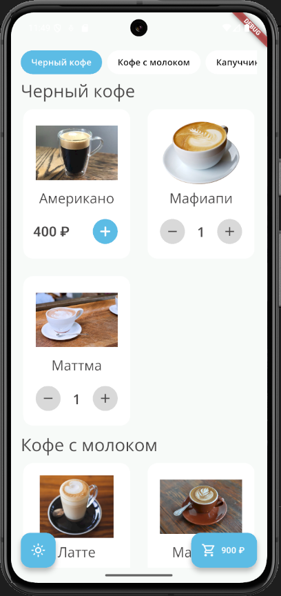
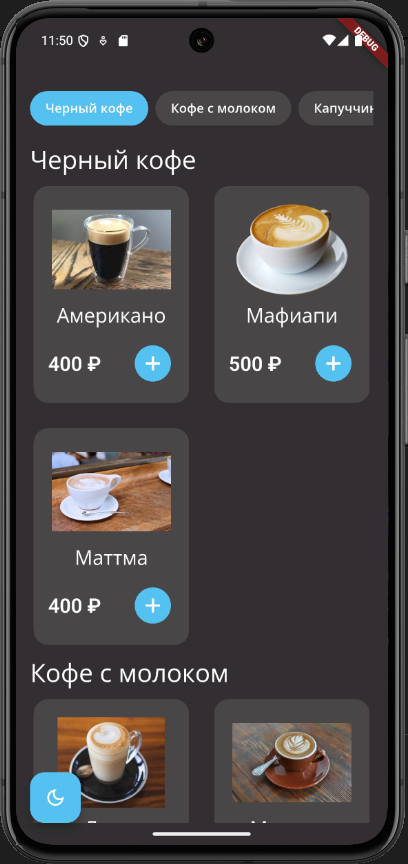
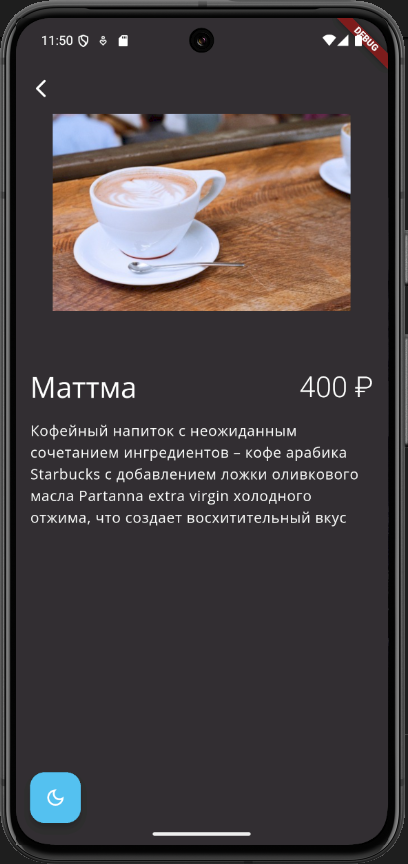
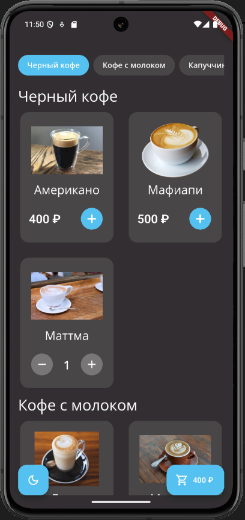
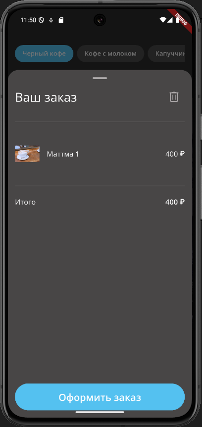
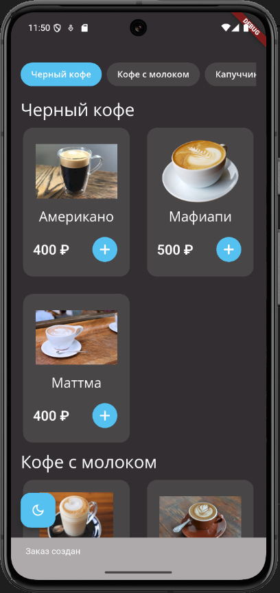

# Coffee App

Приложение для заказа кофе с современным дизайном и удобным интерфейсом.

## Архитектура

Проект построен на основе Clean Architecture с использованием BLoC для управления состоянием:

```
lib/
├── core/
│   ├── config/           # Конфигурация приложения
│   ├── data/            # Реализация репозиториев
│   ├── domain/          # Бизнес-логика и сущности
│   ├── network/         # Сетевой слой
│   └── presentation/    # Общие UI компоненты
└── features/
    ├── coffee_screen/   # Экран со списком кофе
    ├── coffee_detail/   # Детальный экран кофе
    ├── shopping_cart/   # Корзина покупок
    └── main_scaffold/   # Основной каркас приложения
```

## Технологии

- Flutter
- BLoC (State Management)
- Drift (Local Database)
- Clean Architecture
- Retrofit
- Dio

## Скриншоты

#Cветлая тема:

<div align="center">
    
    
    
    
    
</div>
<div align="center">
    
    
    
    
    
</div>

## Основные особенности реализации

### 1. Clean Architecture

- Четкое разделение на слои (domain, data, presentation)
- Независимость бизнес-логики от UI

### 2. State Management

- Использование BLoC для управления состоянием
- Отдельные BLoC'и для каждой фичи
- Чистая обработка состояний и ошибок

### 3. Локальное хранение

- Использование Drift для работы с SQLite
- Кэширование корзины

### 4. UI/UX

- Поддержка темной темы
